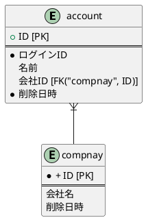

ドキュメント|ドキュメントID|表示グループ名
------------|--------------|--------------
ER図        |ER-ALL        |ER図(全体)    

システム全体のER図

```plantuml
@startuml 

entity "account" {
    + ID [PK]
    ==
    * ログインID
    名前
    会社ID [FK("compnay", ID)]
    * 削除日時
}

entity "compnay" {
    * + ID [PK]
    ==
    会社名
    削除日時
}

"account" }|-- "compnay"
@enduml
```
